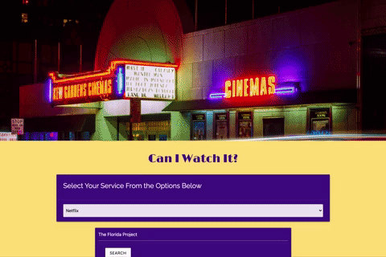

# Can I Watch It?

## Description

A simple way to see what subscription services offer the movie you want! Our motivation for this project is the amount of time wasted searching through the many streaming subscriptions available just to find the one movie you want to watch. Can I Watch It? cuts out the middleman. This project allows you to search for your desired film in the streaming service you have, all on one page. With this application, there is no excuse to fall asleep before the closing credits. With our project, we created the most efficient way find your movie. We learned how to apply more than one API to an application and how to collaborate as a team.

## Table of Contents

- [Usage](#usage)
- [Visual](#visual)
- [Credits](#credits)
- [Links](#links)
- [License](#license)

## Usage

It's simple! Type your chosen movie into the search bar, select the streaming service you are planning to use, and hit the search button. You'll be happy to find whether or not your service offers your movie and as a bonus, you'll find a description of the film and the original movie poster.

## Visual

## Credits

- Streaming Availability API
  - https://rapidapi.com/movie-of-the-night-movie-of-the-night-default/api/streaming-availability/
- OMDB API
  - https://www.omdbapi.com/
- Materialize Front-end Framework
  - https://materializecss.com/

## Links

- Deployed Application
  - https://danielwestiner.github.io/can-I-watch-it/
- GitHub Repository
  - https://github.com/DanielWestiner/can-I-watch-it

## License

MIT License

Copyright (c) [2021] [Daniel Westiner]

Permission is hereby granted, free of charge, to any person obtaining a copy
of this software and associated documentation files (the "Software"), to deal
in the Software without restriction, including without limitation the rights
to use, copy, modify, merge, publish, distribute, sublicense, and/or sell
copies of the Software, and to permit persons to whom the Software is
furnished to do so, subject to the following conditions:

The above copyright notice and this permission notice shall be included in all
copies or substantial portions of the Software.

Application by Kara Heeb, Giovanna Ruggio, Daniel Westiner, and Troy Eutermoser
